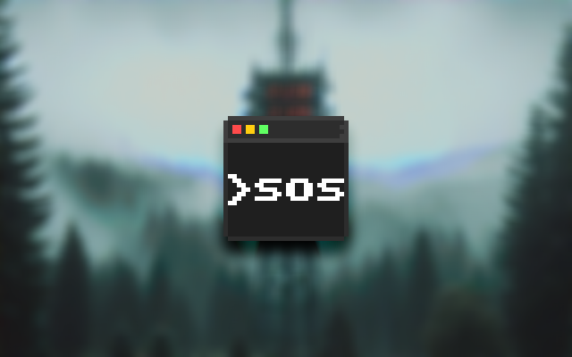

# CWI - Morse Code Audio Generator



CWI - is a command-line instrument capable of generating and playing Morse code audio. It takes a text message as argument or from file, converts it to Morse code, and plays the corresponding audio tone or saves it as a `.wav` file.

## Table of Contents

- [CWI - Morse Code Audio Generator](#cwi---morse-code-audio-generator)
  - [Table of Contents](#table-of-contents)
  - [Features](#features)
  - [Installation](#installation)
    - [From Source](#from-source)
    - [From Release](#from-release)
    - [Build it yourself](#build-it-yourself)
  - [Command-line Options](#command-line-options)
  - [Examples](#examples)
  - [References](#references)

## Features

* Supports Latin and Cyrillic symbols, and some other special characters[^1].
* Customizable frequency, sample rate, and WPM.
* Supports multiple tone generator types: Sine, Sawtooth, Triangle, Square.
* Converts text input into Morse code and generates corresponding audio tones.
* Plays the generated audio directly or saves it to a WAV file.
* Supports both command-line arguments and reading messages from an input file.
* Debugging mode with detailed logging output.

## Installation

### From Source 

1. Clone the repository:

    ```bash
    git clone https://github.com/CoMakar/CWI.git
    cd CWI
    ```

2. Install the project using using pip:

    ```bash
    pip install .
    # or
    python3 -m pip install .
    # or (if you have multiple python versions installed)
    py -*.* -m pip install .
    ```

This will install all necessary dependencies as specified in the `setup.py` file. The `cwi` command should be accessible from anywhere on your system.

> [!IMPORTANT]
> Note that minimal python version required is 3.11.*

### From Release

Pre-built version is available. You can download it from the [Releases](https://github.com/CoMaar/CWI/releases).

> [!IMPORTANT]
> Executable was built using [PyInstaller](https://pyinstaller.org/en/stable/)
> [Windows 10 x64]

### Build it yourself

> [!NOTE]
> This project uses [Pipenv](https://pipenv.pypa.io/en/latest/) to manage virtual environment and all the dependencies.
> Make sure to install it first.

1. Clone the repository:

    ```bash
    git clone https://github.com/CoMakar/CWI.git
    cd CWI
    ```

2. Install with dev dependencies

    ```bash
    pipenv install --dev
    ```

3. Use make file or pyinstaller itself to build the project

    ```bash
    make all
    # or
    pyinstaller setup.spec
    ```

4. Navigate to ./dist/ directory to find the executable

    ```bash
    cd ./bin
    ./cwi "SOS"
    ```

## Command-line Options

* `--tone-generator-type` `-t` : Specifies the type of tone generator. Options: `sine`, `saw`, `triangle`, `square`. Default is `sine`.
* `--frequency` `-f` : Sets the tone generator frequency in Hz. Range: 80-8000. Default is 800Hz.
* `--sample-rate` `-r` : Sets the audio output sample rate in Hz. Range: 8000-96000. Default is 44100Hz.
* `--words-per-minute` `-w` : Specifies the Morse code speed in words per minute (WPM). Range: 5-30. Default is 20 WPM.
* `--debug`: Enables debug mode for more verbose logging.
* `--input-file` `-i` : Specifies a file containing the message to convert to Morse code. Ignores the `message` argument if provided.
* `--output-file` `-o` : Writes the audio output to a `.wav` file instead of playing it back.

## Examples

```bash
# View all options
cwi --help

# Play a simple morse message
cwi SOS

# Play a long morse message
cwi "MAYDAY HOTEL BRAVO X16"

# Save audio to a file
cwi "Hello World" --output-file hello_world.wav

# Use a sawtooth wave generator at 1000 Hz
cwi "CQ DX" -t saw -f 1000

# Read a message from a text file and save the audio:
cwi --input-file message.txt --output-file message_audio.wav
```

## References

[^1]: Morse code \ Crypto Museum : https://www.cryptomuseum.com/radio/morse/ (20.09.2024)

